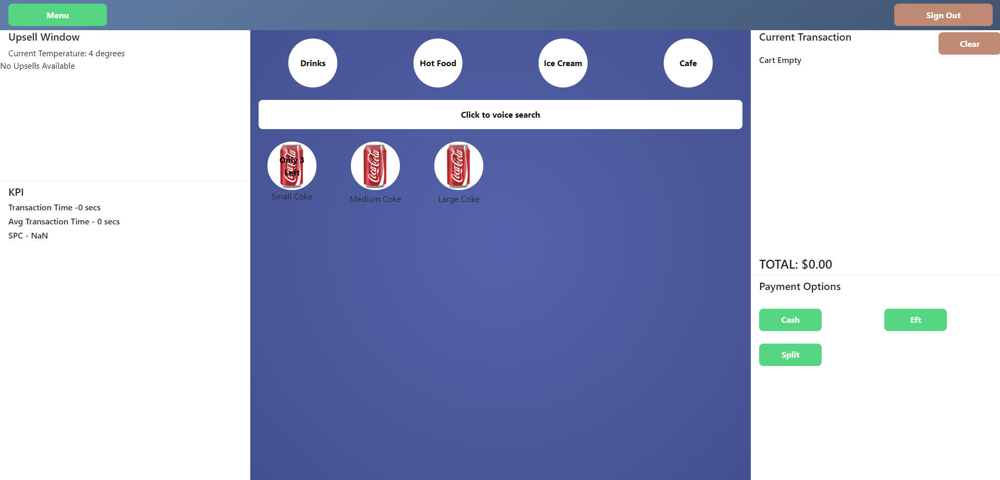

# Futurus Point of Sale
### By trojanface

## Description
Futurus Point of Sale system is a tech demo of my skills in the MERN stack and user experience. Designed to combat the issues of poor user experience when interacting with POS systems Futurus takes advantage of voice recongition and intelligent api design to assist in creating an easy to use application for all age groups and demographics.

## Table of Contents

1. Description
2. Contents
3. Screenshot
4. Deployed
5. Installation
6. Usage
7. License
8. Contributors
9. Profile

## Link to Deployed App
https://futurus-pos.herokuapp.com/

## Installation
Nil

## Usage
1. Navigate to deployed application.
2. Sign in with following details: 

Username: testuser
Password: test10

3. Add items & departments in the item designer.
4. Recieve stock in the stocktake screen.
5. Change user permissions in the user designer.
6. Pull basic reports in the reports screen.
7. Process 'mock' transactions on the POS screen.
	a. If using chrome make use of the voice search function.
8. Enjoy!

## License
Proprietary

## Contributors
trojanface

